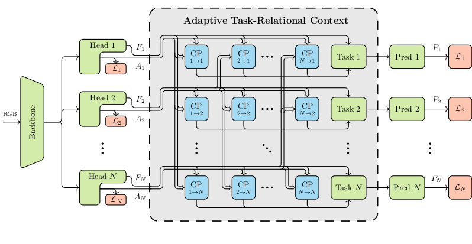

# Adaptive Task-Relational Context (ATRC)

This repository provides source code for the ICCV 2021 paper [Exploring Relational Context for Multi-Task Dense Prediction](https://arxiv.org/abs/2104.13874). The code is organized using [PyTorch Lightning](https://github.com/PyTorchLightning/pytorch-lightning). 



## Overview

ATRC is an attention-driven module to refine task-specific dense predictions by capturing cross-task contexts. Through Neural Architecture Search (NAS), ATRC selects contexts for multi-modal distillation based on the source-target tasks' relation. We investigate four context types: global, local, *t*-label and *s*-label (as well as the option to sever the cross-task connection). In the figure above, each CP block handles one source-target task connection.

We provide code for searching ATRC configurations and training various multi-modal distillation networks on the NYUD-v2 and PASCAL-Context benchmarks, based on HRNet backbones. 

## Usage

### Requirements

The code is run in a `conda` environment with Python 3.8.11:
```bash
conda install pytorch==1.7.0 torchvision==0.8.1 cudatoolkit=10.1 -c pytorch
conda install pytorch-lightning==1.1.8 -c conda-forge
conda install opencv==4.4.0 -c conda-forge
conda install scikit-image==0.17.2
pip install jsonargparse[signatures]==3.17.0
```

### Download the Data

Before running the code, download and extract the datasets to any directory `$DATA_DIR`:
```bash
wget https://data.vision.ee.ethz.ch/brdavid/atrc/NYUDv2.tar.gz -P $DATA_DIR
wget https://data.vision.ee.ethz.ch/brdavid/atrc/PASCALContext.tar.gz -P $DATA_DIR
tar xfvz $DATA_DIR/NYUDv2.tar.gz -C $DATA_DIR && rm $DATA_DIR/NYUDv2.tar.gz
tar xfvz $DATA_DIR/PASCALContext.tar.gz -C $DATA_DIR && rm $DATA_DIR/PASCALContext.tar.gz
```

### ATRC Search

To start an ATRC search on NYUD-v2 with a HRNetV2-W18-small backbone, use for example:
```bash
python ./src/main_search.py --cfg ./config/nyud/hrnet18/atrc_search.yaml --datamodule.data_dir $DATA_DIR --trainer.gpus 2 --trainer.accelerator ddp
```
The path to the data directory `$DATA_DIR` needs to be provided. With every validation epoch, the current ATRC configuration is saved as a `atrc_genotype.json` file in the log directory.

### Multi-Modal Distillation Network Training

To train ATRC distillation networks supply the path to the corresponding `atrc_genotype.json`, e.g., `$GENOTYPE_DIR`: 
```bash
python ./src/main.py --cfg ./config/nyud/hrnet18/atrc.yaml --model.atrc_genotype_path $GENOTYPE_DIR/atrc_genotype.json --datamodule.data_dir $DATA_DIR --trainer.gpus 1
```
Some genotype files can be found under `genotypes/`.

Baselines can be run by selecting the config file, e.g., multi-task learning baseline:
```bash
python ./src/main.py --cfg ./config/nyud/hrnet18/baselinemt.yaml --datamodule.data_dir $DATA_DIR --trainer.gpus 1
```

The evaluation of boundary detection is disabled, since the MATLAB-based [SEISM](https://github.com/jponttuset/seism) repository was used for obtaining the optimal dataset F-measure scores. Instead, the boundary predictions are simply saved on the disk in this code.

## Citation

If you find this code useful in your research, please consider citing the paper:
```bibtex
@InProceedings{bruggemann2020exploring,
  Title     = {Exploring Relational Context for Multi-Task Dense Prediction},
  Author    = {Bruggemann, David and Kanakis, Menelaos and Obukhov, Anton and Georgoulis, Stamatios and Van Gool, Luc},
  Booktitle = {ICCV},
  Year      = {2021}
}
```

## Credit

The pretrained backbone weights and code are from [MMSegmentation](https://github.com/open-mmlab/mmsegmentation). The distilled surface normal and saliency labels for PASCAL-Context are from [ASTMT](https://github.com/facebookresearch/astmt). Local attention CUDA kernels are from [this repo](https://github.com/zzd1992/Image-Local-Attention).

## Contact

For questions about the code or paper, feel free to contact me ([send email](mailto:brdavid@vision.ee.ethz.ch)).
